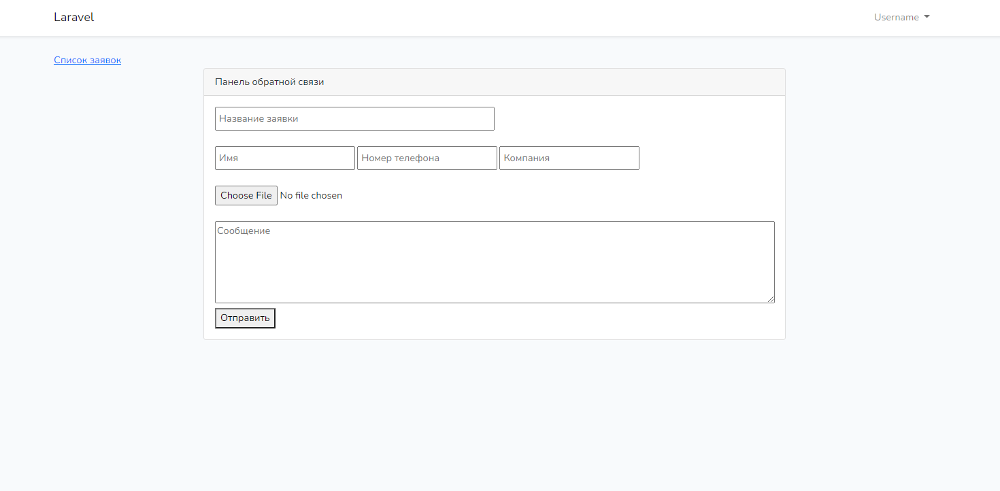
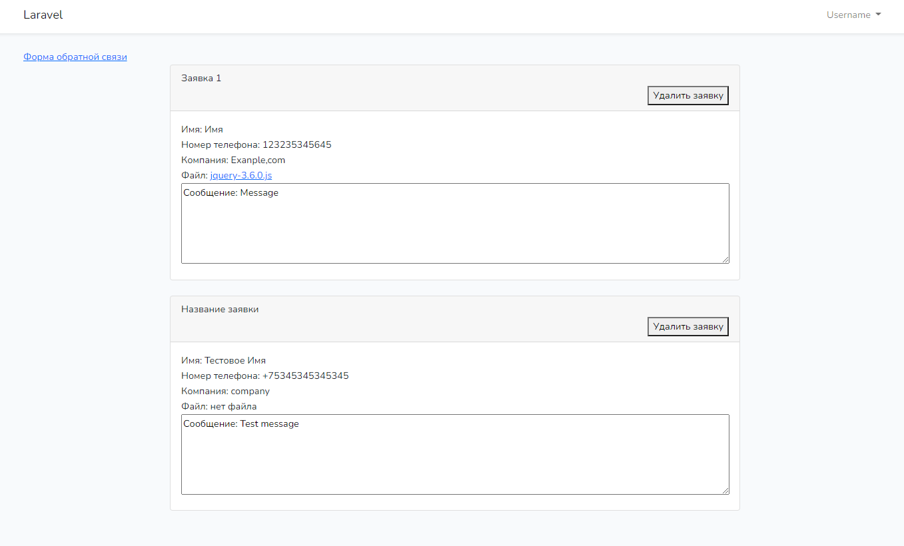

# ToDoList на Laravel



## Описание
### 1 Скачайте и установите Open Server


### 2 Зайдипе в папку \openserver\domains и скачайте проект
```bash
git clone https://github.com/MindYume/Laravel-feedback.git
```
