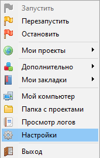
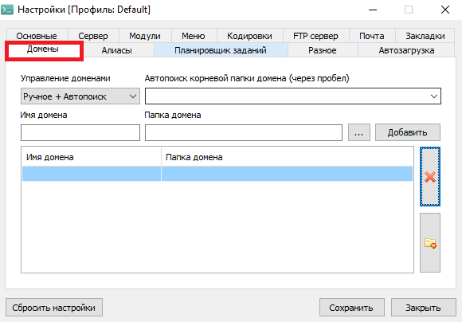
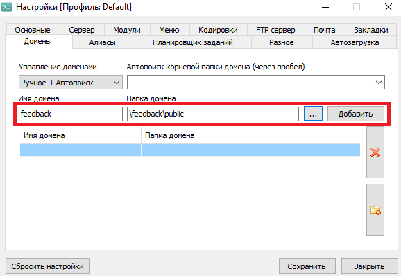
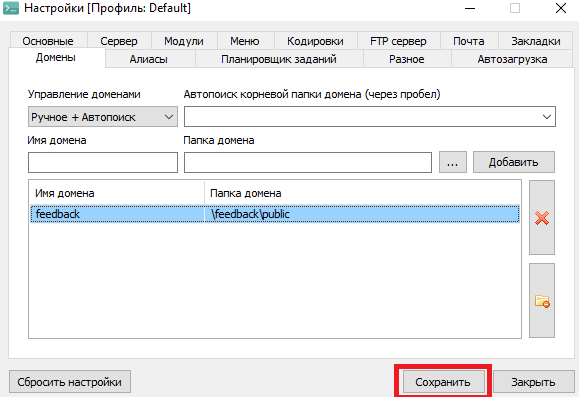
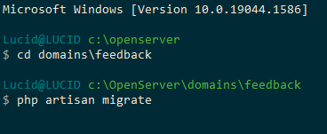

# ToDoList на Laravel


## Устнаовка
### 1 Скачайте и установите Open Server
https://ospanel.io/

### 2 Зайдипе в папку \openserver\domains и скачайте проект
```bash
git clone https://github.com/MindYume/Laravel-ToDoList.git
```
### 3 Запустите Open Server, и зайдите в настройки

### 4 В настройках зайдите в раздел "Домены" и добавтье домен с любым именем




### 5 Создайте базу данных из миграций. 
Для этого запуствите консоль через Open Server, зайдите в папку с проектам и запустите следующую команду
```bash 
php artisan migrate
```

### 6 Теперь вы пожете запустить Open Server и в любом браузере ввести название домена, котрое вы дали проекту, и посмотреть на результат.

